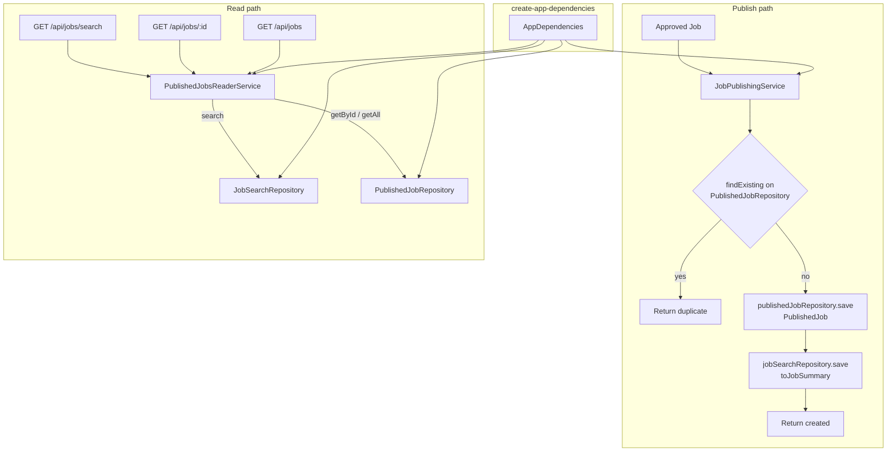

# Task 20: Split Published Full Store from Search-Only Store

Status: Complete

## Purpose

Separate full-job retrieval from search indexing.

Today the published in-memory store holds complete `Job` records (including `description`, `rawData`, and other fields) and also serves `GET /api/jobs/search`. Search only needs the summary fields returned on that endpoint. After this task, publishing dual-writes a slim search document, and search no longer scans full jobs.

## Implementation Details

- Keep `PublishedJobRepository` for full published jobs: `save`, `getAll`, `getById`.
- Remove `search` from `PublishedJobRepository`.
- Add a search-directed repository (for example `JobSearchRepository`) with `save` and `search(JobSearchQuery)` only — not full `Job` CRUD.
- Persist `JobSummary` documents in the search store (reuse the existing type: `id`, `title`, `company`, `location`, `employmentType`, optional `salary` / `postedAt`). Do not store `description`, `rawData`, `language`, `companyType`, or source metadata in the search store.
- On approve/publish, dual-write:
  1. full `PublishedJob` to the published store
  2. a `JobSummary` projection to the search store (reuse `toJobSummary`)
- Wire `JobReaderService` so:
  - `search` reads from the search store
  - `getById` / `getAll` read from the published store
- Wire both repositories in `create-app-dependencies.ts`.
- Move title/company search, country filter, and salary/posted-date sort logic from the published repository into the new in-memory search repository.
- Update repository, publishing, job-reader, and jobs API tests.

This mirrors a document-store vs search-index split. Both remain in-memory for the take-home.

## Files And Modules Touched

- `server/src/domain/job/job.repository.ts`
- `server/src/domain/job/job.types.ts` (only if a thin search-document wrapper is needed)
- `server/src/infrastructure/repositories/`
- `server/src/workflows/publishing/job-publishing-service.ts`
- `server/src/workflows/job-reader/job-reader-service.ts`
- `server/src/create-app-dependencies.ts`
- backend tests

## Acceptance Criteria

- Search store persists only summary fields needed by `GET /api/jobs/search`.
- Publishing writes both the full published job and the search summary.
- `GET /api/jobs/search` behavior is unchanged (title/company search, country filter, sort).
- `GET /api/jobs/{id}` still returns the full job from the published store.
- `PublishedJobRepository` no longer implements `search`.
- Tests cover dual-write on publish and search against the search store.

## Verification Steps

```bash
npm test -w server
npm run typecheck -w server
```

Manually ingest sample jobs, then confirm:

- `GET /api/jobs/search` still filters and sorts correctly
- `GET /api/jobs/{id}` still returns full job details

## Prerequisites

- Task 06 complete.
- Task 10 complete.
- Task 12 complete.

## Handoff Notes

Do not change API response shapes or the frontend. This is an internal storage boundary cleanup so search scales like a dedicated index while detail retrieval keeps the full document.

## Solution diagram

How publish and reads are wired after this task:



Component roles:

- `PublishedJobRepository` — full documents; identity/dedupe (`getById`, `findBySource`); detail and list-all reads
- `JobSearchRepository` — `JobSummary` index only (`save`, `search`); OpenSearch/ES seam
- `JobPublishingService` — dedupe against published store first; dual-write summary only on create; log + rethrow if index save fails
- `PublishedJobsReaderService` — routes search to the index, detail/`getAll` to the published store
